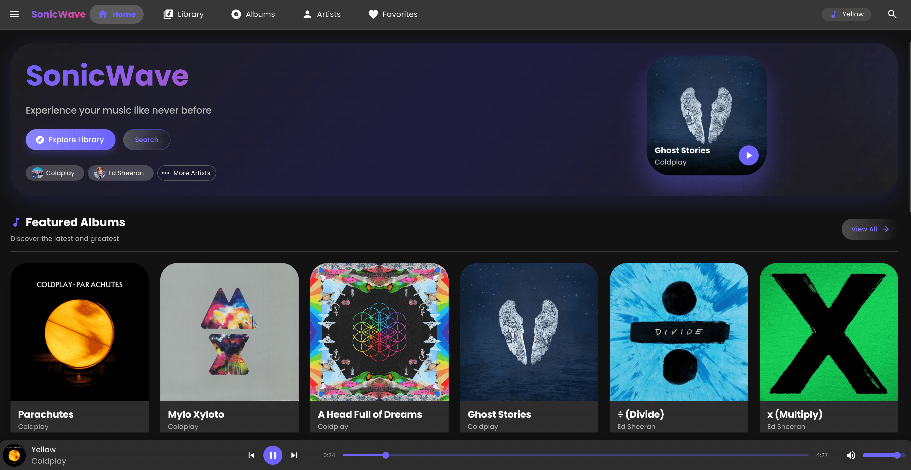

# SonicWave - Modern Music Player

SonicWave is a sleek, modern music player with a beautiful UI and smooth animations. It's designed to provide an exceptional music listening experience across all screen sizes.
[](https://sonicwave-music-player.vercel.app/)

## Features

- 🎵 Play local MP3 files with beautiful album artwork
- 📱 Responsive design that works on mobile, tablet, and desktop
- 📚 Library management with sort and search functionality
- 💿 Album view with detailed information
- 🎤 Artist view with albums and songs
- 🎧 Full-featured music player with playback controls
- 🌓 Dark theme for comfortable viewing
- ✨ Smooth animations and transitions

## Technologies Used

- [React](https://reactjs.org/) - Frontend library
- [TypeScript](https://www.typescriptlang.org/) - Type safety
- [Material UI](https://mui.com/) - UI components
- [Framer Motion](https://www.framer.com/motion/) - Animations
- [React Router](https://reactrouter.com/) - Routing

## Getting Started

### Prerequisites

- Node.js and npm installed on your machine

### Installation

1. Clone the repository
   ```
   git clone https://github.com/Akankshaaaa/sonicwave-music-player.git
   cd sonicwave
   ```

2. Install dependencies
   ```
   npm install
   ```

3. Place your MP3 files in the `/public/audio` directory

4. Start the development server
   ```
   npm start
   ```

5. Open [http://localhost:3000](http://localhost:3000) to view the app in your browser


## Usage

- **Home Page**: View featured albums and recently added songs
- **Library**: Browse all songs with sorting and filtering
- **Albums**: View all albums and click to see details
- **Artists**: Browse artists and their albums
- **Player**: Full-screen player with album art and controls
- **Favorites**: View all the songs that you "heart"


## Customization

You can customize the app by:

1. Adding your own songs to the `/public/audio` directory
2. Updating the song data in `src/data/songs.ts`
3. Modifying the theme in `src/theme/theme.ts`
